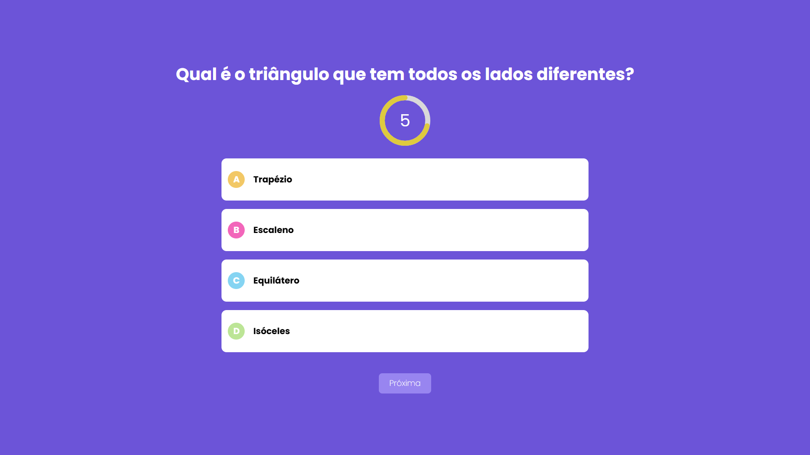
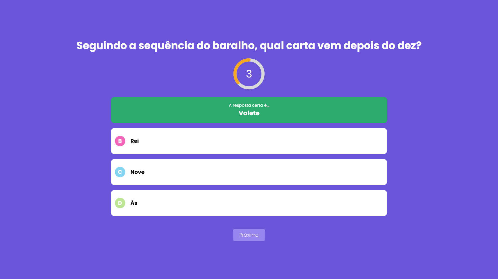
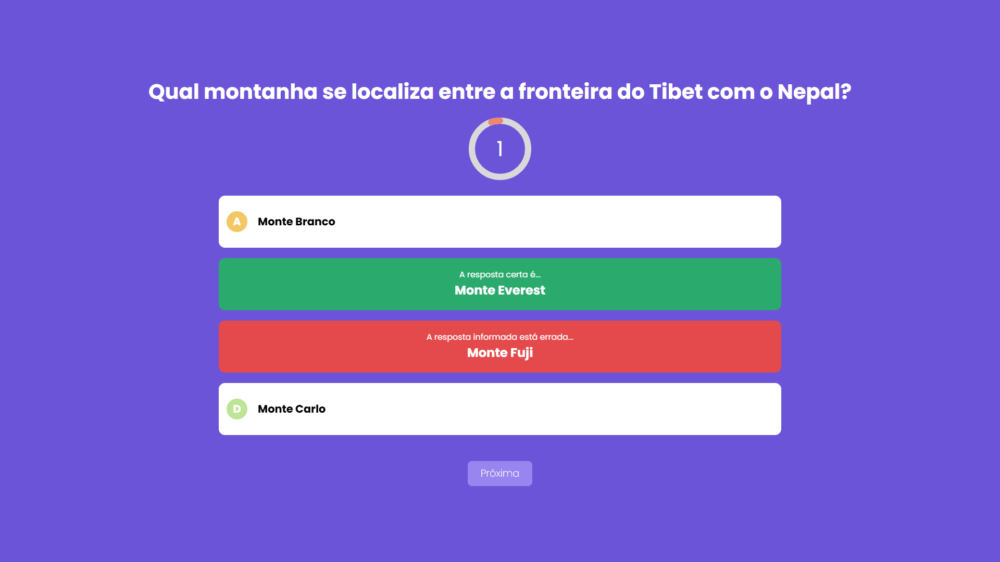
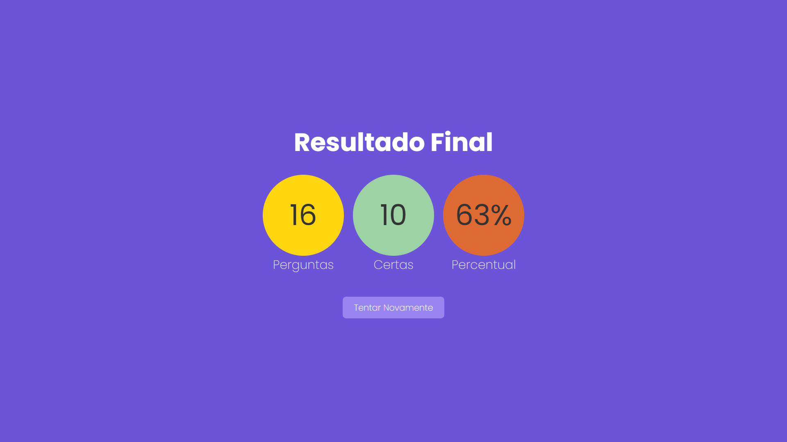

<div align="center">
  <h1>Quiz Full-Stack Interativo</h1>
  <p>Uma aplicação web de perguntas e respostas moderna, desenvolvida com arquitetura full-stack, animações dinâmicas e design responsivo.</p>
</div>

<br>

<p align="center">
  
  
  
  
</p>

---

## 📌 Sobre o Projeto

Este projeto é um **Quiz Full-Stack** interativo construído para proporcionar uma experiência de jogo dinâmica e fluida. A aplicação conta com lógica de temporização regressiva por questão, sistema de validação de acertos/erros com feedback visual imediato através de efeitos de rotação (flip cards), e uma tela de estatísticas finais detalhadas.

---

## 📸 Demonstração Visual

Abaixo estão as principais telas do quiz em sequência:

### 1. Tela de Pergunta (Padrão)
Visual da questão com o temporizador circular e as opções de resposta prontas para seleção.
<br>


<br>

### 2. Feedback de Acerto
A interface muda de cor instantaneamente ao selecionar a resposta correta, com o efeito "flip card" visível.
<br>


<br>

### 3. Feedback de Erro
Indicação visual da resposta errada e revelação automática da resposta correta.
<br>


<br>

### 4. Tela de Resultado Final
Resumo estatístico do desempenho com número de perguntas, acertos e porcentagem final.
<br>


---

## ✨ Funcionalidades

- **⏱️ Temporizador Dinâmico:** Círculo regressivo animado (`react-countdown-circle-timer`) com transição de cores conforme o tempo esgota.
- **🔄 Efeito de Revelação (Flip Cards):** Transição visual suave ao selecionar uma resposta para mostrar o resultado correto ou incorreto.
- **🔗 Rotas Dinâmicas de API:** Estrutura full-stack no Next.js (Pages Router) com endpoints dedicados para busca de questões e gestão do questionário.
- **📊 Tela de Estatísticas:** Cálculo automático do total de perguntas, respostas corretas e aproveitamento percentual ao finalizar o quiz.
- **🎨 Design Moderno e Responsivo:** Estilização limpa e focada na experiência do usuário.

---

## 🛠️ Tecnologias Utilizadas

O projeto foi desenvolvido utilizando as seguintes tecnologias e bibliotecas:

* **[Next.js](https://nextjs.org/)** (Pages Router) - Framework React para aplicações full-stack e otimização de rotas.
* **[TypeScript](https://www.typescriptlang.org/)** - Superset JavaScript para tipagem estática e segurança do código.
* **[React](https://react.dev/)** - Biblioteca principal para construção da interface de usuário.
* **[Tailwind CSS](https://tailwindcss.com/)** - Framework CSS utilitário para estilização rápida e responsiva.
* **`react-countdown-circle-timer`** - Biblioteca para a animação do cronômetro circular.

---

## ⚙️ Como Executar o Projeto

Para executar este projeto localmente na tua máquina, segue os passos abaixo:

1. **Clona o repositório:**
   ```bash
   git clone https://github.com/Erick-de-Paiva/projeto-quiz-fullstack.git
   cd projeto-quiz-fullstack
   ```

2. **Instala as dependências:**
   ```bash
   npm install
   ```

3. **Inicia o servidor de desenvolvimento:**
   ```bash
   npm run dev
   ```

4. **Acesse a aplicação:**
   Abre o teu navegador e acesse a `http://localhost:3000`.

---

## 📦 Build de Produção

Para testar a versão otimizada de produção localmente:

```bash
# Gera o build otimizado
npm run build

# Inicia o servidor de produção
npm run start
```
